# Side Effect Fact-Check: Architecture and Flow

How a question like *"Is nausea a real side effect of ibuprofen?"* becomes a verdict card. The diagrams
render on GitHub (Mermaid). Every number below matches the code: file and constant names are given so
the doc can be checked against the source.

**Contents**

1. [System context](#1-system-context): who and what the app talks to
2. [Components](#2-components): what lives in which file
3. [Request lifecycle](#3-request-lifecycle): one `/chat` call, end to end
4. [Agent loop](#4-agent-loop): the harness in `run_agent()`
5. [Tool routing](#5-tool-routing): which tool answers which question
6. [`assess_signal` pipeline](#6-assess_signal-pipeline): how a verdict is built
7. [openFDA access and error handling](#7-openfda-access-and-error-handling), then [guardrails](#7b-guardrails)
8. [Sessions](#8-sessions)
9. [Deployment](#9-deployment)
10. [Design decisions](#10-design-decisions)

---

## 1. System context

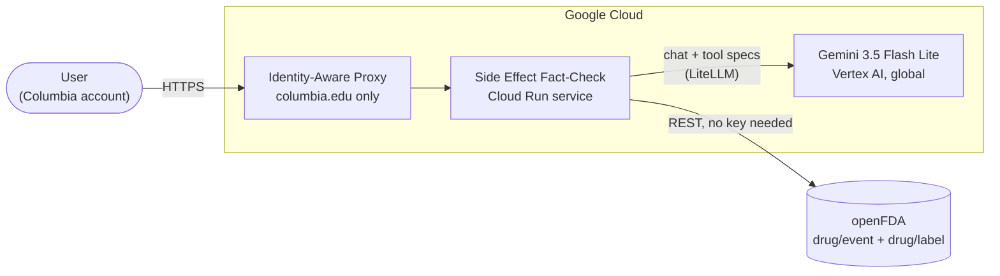

| External system | Used for | Auth |
|---|---|---|
| Vertex AI (Gemini) | Deciding which tools to call and writing the reply | Cloud Run service account (no API key in code) |
| openFDA `drug/event.json` | Adverse-event report counts (FAERS) | None; optional `OPENFDA_API_KEY` env var raises the daily limit |
| openFDA `drug/label.json` | Official FDA label text | Same as above |

---

## 2. Components

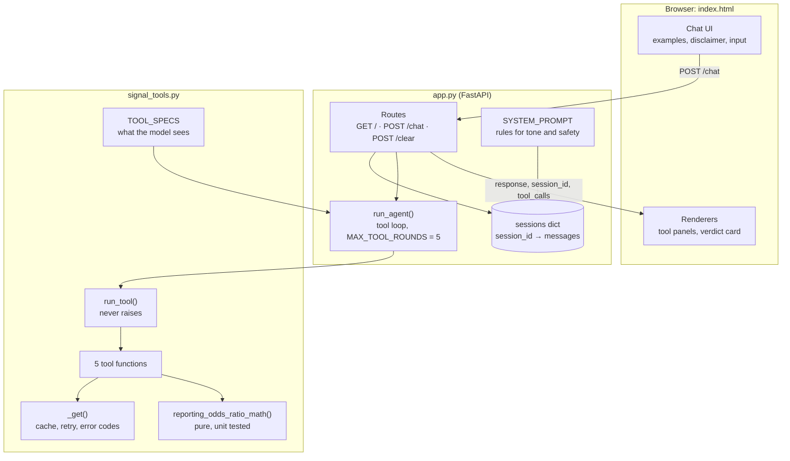

| File | Responsibility | Depends on |
|---|---|---|
| `index.html` | UI only: sends messages, renders replies, tool panels and the verdict card. No build step. | `/chat`, `/clear` |
| `app.py` | HTTP API, session store, system prompt, the agent loop. Knows nothing about openFDA. | `signal_tools.TOOL_SPECS`, `run_tool` |
| `signal_tools.py` | All domain logic: openFDA queries, statistics, label matching, error codes. Knows nothing about the web or the model. | `requests` |
| `test_signal_tools.py` | Offline unit tests (network mocked). | `signal_tools` |

The boundary between `app.py` and `signal_tools.py` is two names: `TOOL_SPECS` and `run_tool`. Swapping
the model or the web framework does not touch the tools, and the tools can be tested without either.

---

## 3. Request lifecycle

One user message, from click to rendered answer (sample query 1):

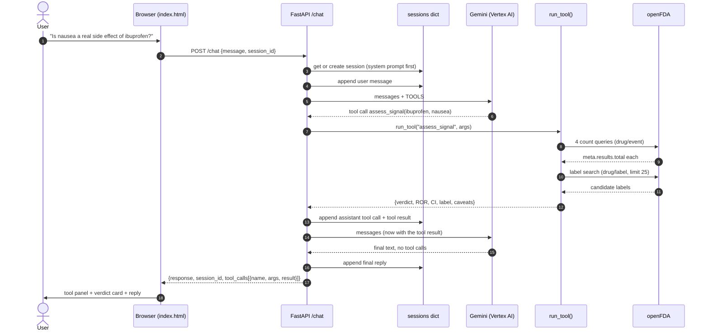

The `/chat` response shape is kept from the starter so the UI can show every tool call:

```json
{
  "response": "Nausea is reported disproportionately with ibuprofen ...",
  "session_id": "6649eedd-...",
  "tool_calls": [
    {"name": "assess_signal", "args": {"drug": "ibuprofen", "reaction": "nausea"}, "result": "{\"verdict\": \"known_effect\", ...}"}
  ]
}
```

---

## 4. Agent loop

`run_agent()` in `app.py`. The model proposes; the harness executes. The model never touches the
network directly.

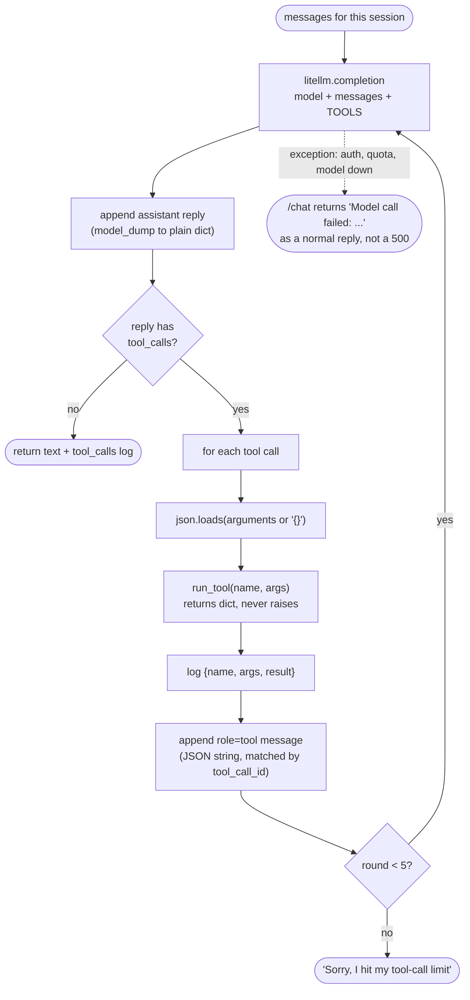

Guard rails in the loop:

| Risk | Guard |
|---|---|
| Model loops on tools forever | `MAX_TOOL_ROUNDS = 5` |
| Model invents a tool name | `run_tool` returns `UNKNOWN_TOOL` with the list of valid names |
| Model sends wrong argument names | `run_tool` returns `BAD_ARGUMENTS` with the Python error text |
| Any other bug inside a tool | `run_tool` returns `TOOL_CRASH`; the conversation continues |
| Model / Vertex AI failure | Caught in `/chat`, shown in the chat window |

---

## 5. Tool routing

The system prompt maps question types to tools. The model chooses, but the descriptions in
`TOOL_SPECS` and the prompt steer it:

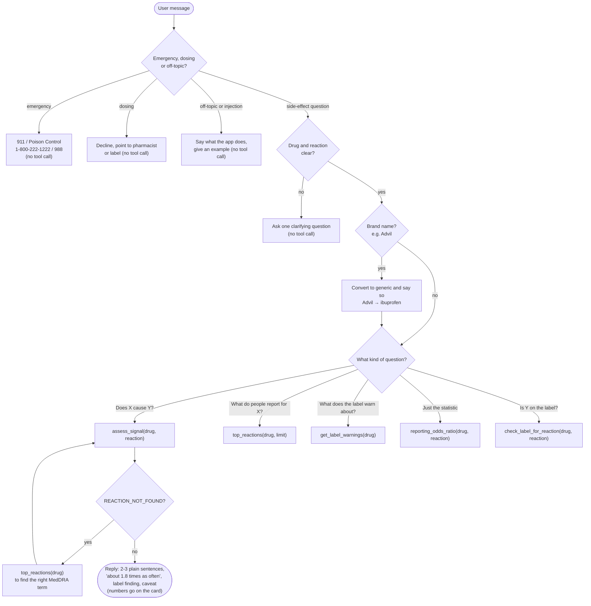

| Tool | External calls | Returns |
|---|---|---|
| `assess_signal` | 4 event counts + 1 label search | Verdict, ROR, 95% CI, label snippet, caveats |
| `reporting_odds_ratio` | 4 event counts | ROR, 95% CI, 2×2 counts, plain reading |
| `top_reactions` | 1 event count-by-reaction | Top N reactions with report counts |
| `get_label_warnings` | 1 label search | Boxed warning, warnings, adverse reactions (truncated to 1,200 chars each) |
| `check_label_for_reaction` | 1 label search | `on_label`, sections, snippet |

---

## 6. `assess_signal` pipeline

The main tool. It answers "does X really cause Y?" by combining two independent sources of
evidence: what people report, and what the FDA label already says.

### 6a. Reporting odds ratio

Four openFDA counts fill a 2×2 table (`reporting_odds_ratio_math`):

|  | Reaction Y | Any other reaction |
|---|---|---|
| **Drug X** | a = drug AND reaction | b = drug total − a |
| **All other drugs** | c = reaction total − a | d = all reports − a − b − c |

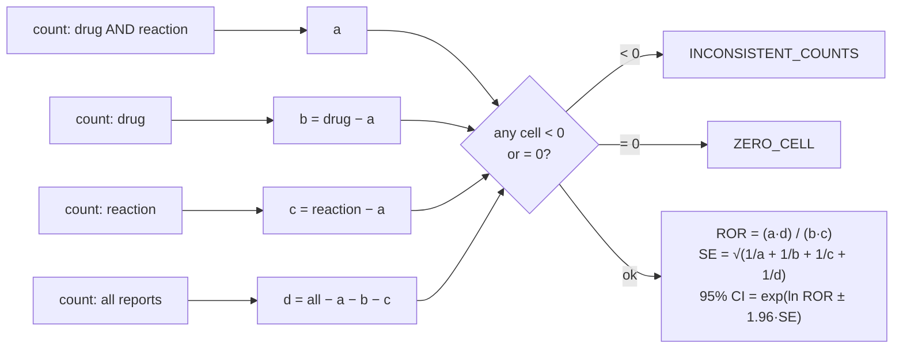

Ibuprofen + nausea (live): a = 18,315 → **ROR 1.78, 95% CI 1.76–1.81**.

### 6b. Label match

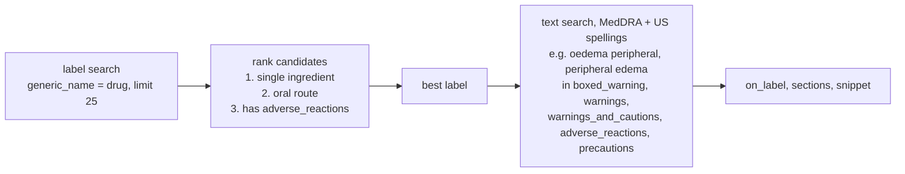

Ranking matters: the first search hit for ibuprofen is an OTC "Drug Facts" label with no adverse
reactions section, which made nausea look "not on label". Ciprofloxacin matched its eye-drop label (no tendon warning), and British MedDRA spellings missed US label text. `_label_rank` and `_spellings` fix both, with unit tests; see the Validation table in the README.

### 6c. Verdict

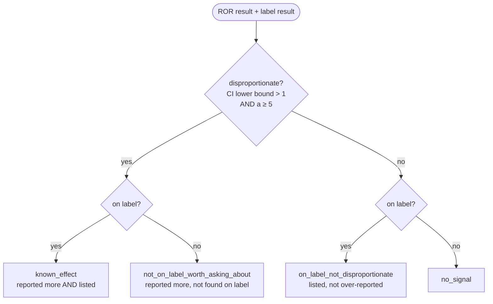

The `a ≥ 5` rule stops a handful of reports from producing a dramatic but meaningless ratio.

---

## 7. openFDA access and error handling

Every openFDA call goes through `_get()` in `signal_tools.py`:

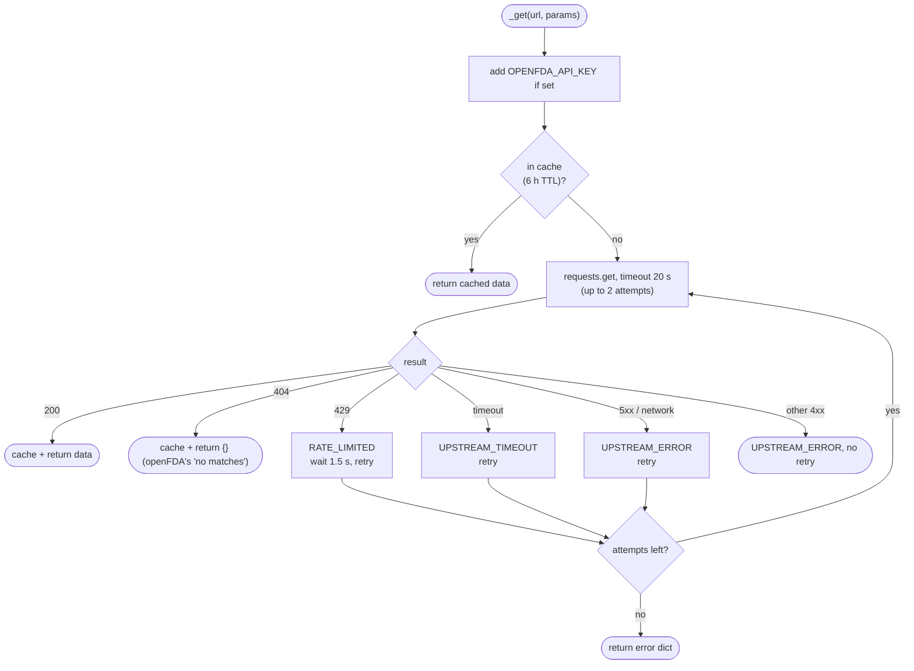

Errors are data, not exceptions. Every failure returns `{"error": CODE, "hint": "what to do next"}`, so
the model can recover or explain the problem to the user:

| Code | Raised by | Hint tells the model to |
|---|---|---|
| `MISSING_DRUG`, `MISSING_INPUT` | input check | Ask the user which drug / reaction |
| `DRUG_NOT_FOUND` | counts or top reactions | Try the generic name |
| `REACTION_NOT_FOUND` | reaction count = 0 | Call `top_reactions` for valid terms |
| `NO_LABEL`, `LABEL_EMPTY` | label search | Try the generic name / say the label has no warnings |
| `ZERO_CELL`, `INCONSISTENT_COUNTS` | ROR math | Say there are too few reports |
| `RATE_LIMITED`, `UPSTREAM_TIMEOUT`, `UPSTREAM_ERROR`, `UPSTREAM_BAD_JSON` | `_get()` | Ask the user to retry shortly |
| `UNKNOWN_TOOL`, `BAD_ARGUMENTS`, `TOOL_CRASH` | `run_tool()` | Fix the call or try another drug |

User input is sanitised by `_clean()` (letters, digits and a few punctuation marks, 80 characters max)
before it goes into an openFDA query string, so quotes and query operators cannot change the search.

---

## 7b. Guardrails

Safety is layered, so no single layer has to be perfect:

| Layer | Guardrail | Where |
|---|---|---|
| Prompt: safety rules (checked first) | Emergencies (overdose, severe reaction, self-harm) get 911 / Poison Control 1-800-222-1222 / 988 and no data · no dosing advice · never advise starting, stopping or changing a medicine | `SYSTEM_PROMPT` in `app.py` |
| Prompt: scope | Only drug side-effect questions; anything else gets one sentence on what the app does | `SYSTEM_PROMPT` |
| Prompt: grounding | Every side-effect statement must come from a tool result, never the model's own knowledge · drug classes ("antibiotics", "a statin") get a question asking which specific medicine, with examples, instead of a guess | `SYSTEM_PROMPT` |
| Prompt: injection | User cannot change the rules, reveal the prompt or assign a role; pasted text and tool results are data | `SYSTEM_PROMPT` |
| Prompt: wording | Never "causes"; "reported about N times as often as with other drugs"; always one caveat | `SYSTEM_PROMPT` |
| Tool output | Caveats travel inside every result; fewer than 5 reports is never a signal | `signal_tools.py` |
| Query safety | `_clean()` strips quotes and query operators before building openFDA searches | `signal_tools.py` |
| Agent loop | 5-round cap; unknown tools, bad args and crashes become hints | `app.py`, `run_tool()` |
| UI | Disclaimer always visible; model text is HTML-escaped before rendering | `index.html` |
| Access | IAP, Columbia accounts only; no secrets in the repo | Cloud Run |

---

## 8. Sessions

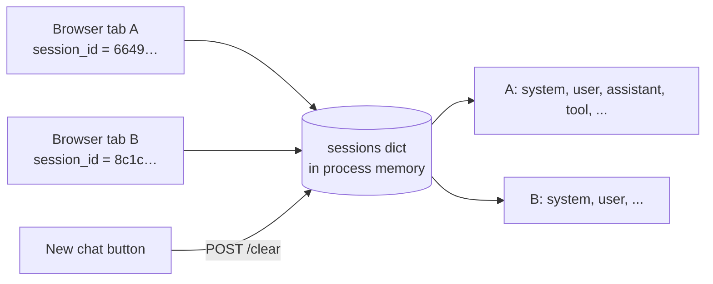

- The server issues a `session_id` (UUID4) on the first message; the browser sends it back on every turn.
- Each session holds the full message list, including tool calls and results, so follow-ups like
  *"How does acetaminophen compare?"* reuse the earlier reaction.
- Verified: a new session does not see another session's history.
- **Trade-off:** sessions live in one process's memory. Cloud Run is set to **max instances = 1** so all
  requests reach the same process. Sessions reset when the instance restarts. A shared store
  (Firestore, Redis) would remove both limits but is not needed at class scale.

---

## 9. Deployment

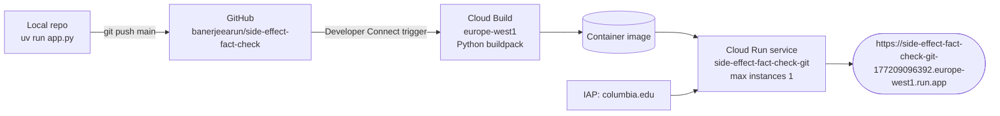

| Setting | Value | Why |
|---|---|---|
| Build | Google Cloud buildpack (no Dockerfile) | `pyproject.toml` + `uv.lock` are enough |
| Entrypoint | `uvicorn app:app --host 0.0.0.0 --port $PORT` | Cloud Run sets `$PORT` and needs `0.0.0.0` |
| Max instances | 1 | Keeps in-memory sessions consistent |
| Access | IAP, `columbia.edu` | Only Columbia accounts can sign in |
| Secrets | None in the repo | Vertex AI uses the service account; `OPENFDA_API_KEY` is optional and set as an env var |

---

## 10. Design decisions

| Decision | Alternative considered | Why this way |
|---|---|---|
| Reporting odds ratio, not raw counts | Show top report counts only | Popular drugs have more reports of everything; the ratio compares against all other drugs |
| Combine reports **and** label in one tool | Let the model call two tools and combine | One deterministic verdict, computed in tested Python instead of by the model |
| Say "reported N times as often", never "causes" | Plain "causes" language, or statistical jargon | Spontaneous reports cannot prove causation; plain wording is readable, and the card keeps the exact statistics |
| Errors returned as `{error, hint}` | Raise exceptions | The model cannot see exceptions; a hint lets it retry or explain |
| Pure math function, tested offline | Compute inline in the tool | Statistics are checked without the network (20 unit tests) |
| 6-hour response cache | No cache | Follow-up questions repeat counts (e.g. "all reports"); saves openFDA quota and latency |
| `max(..., key=_label_rank)` over 25 labels | Take the first label | First hit is often an OTC or combination label |
| Domain logic isolated in `signal_tools.py` | Tools inside `app.py` | Clear boundary (`TOOL_SPECS`, `run_tool`); either side can change alone |

### Known limits

- Label matching is plain text, so synonyms ("emesis" vs "vomiting") are missed.
- openFDA data is voluntary and unverified; counts are affected by publicity, reporting habits and why people take the drug.
- Without an API key, openFDA allows 1,000 requests a day per IP. `assess_signal` uses up to 5, and the cache absorbs repeats.
